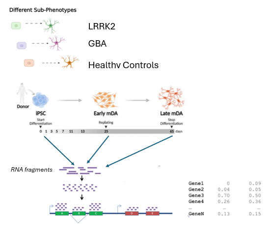

# Master_Thesis-Neurodevelopmental_trajectory_PD

  <h3 align="center">Master_Thesis-Neurodevelopmental_trajectory_PD</h3>

  

    Master Thesis System Biology  
  

<!-- ABOUT THE PROJECT -->
## About The Project

performing trajectory analysis to study transcriptomic changes during the differentiation of human induced pluripotent cells (iPSCs) in Parkinson’s Disease (PD) using main tools SCORPIUS, TSCAN and Slingshot. Exploring differences among genetic-subtypes of PD through trajectory inference and simultaneous component analysis using ALASCA. Pdf report of the thesis is uploaded for reference 

Bird eye view of the project:
* Trajectory inference analysis, comparing various tool (Tool_Comparison.R)
* Extraction of pseudotime and linear modelling (Pseudotime_TI_LMM.R)
* ASCA modelling dataset formatting (ALASCA_dataset.R)
* ASCA modelling analysis (ALASCA_Analysis.R) 

<!-- DATA -->
### Data

Data directory is uploaded in zenodo at link below.  

</a>

